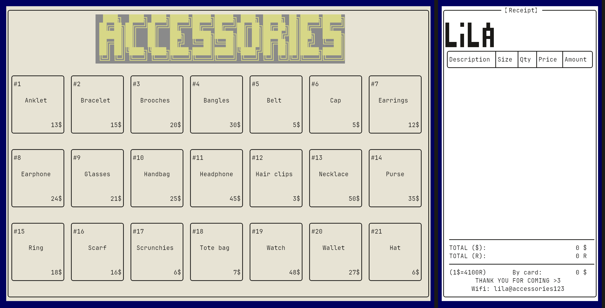

# POS CLI

## Introduction

**(P)oint (O)f (S)ale Accessories CLI** is a sell management on linux which
capability with old hardware allow low-end pc run soomthly

## Image



<p align="center">
  
  
</p>

---

## Installation

### 1. Install dependencies

### (Arch Linux)

```bash
yay -S ncurses qrencode make git g++
git clone https://github.com/TinaGrim/POS_accessories_CLI.git
cd POS_accessories_CLI
```

### (Debian)

```bash
sudo apt update && sudo apt install libncurses-dev libqrencode-dev make git g++
git clone https://github.com/TinaGrim/POS_accessories_CLI.git
cd POS_accessories_CLI
```

### (Window)

```bash
pacman -S mingw-w64-ucrt-x86_64-gcc make git mingw-w64-ucrt-x86_64-ncurses
git clone https://github.com/TinaGrim/POS_accessories_CLI.git 
cd POS_accessories_CLI
```

### 2. Run Program

```bash
make run && make clean
```
